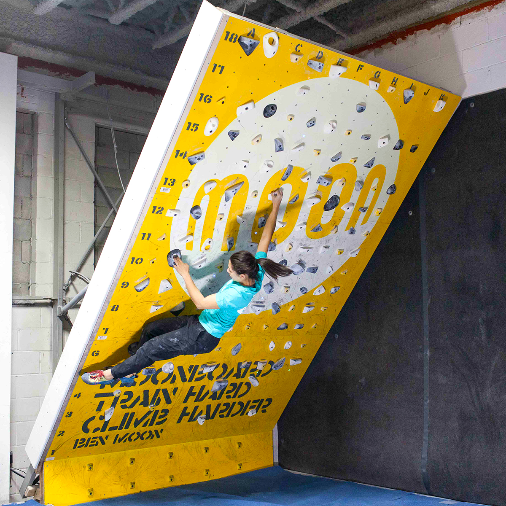
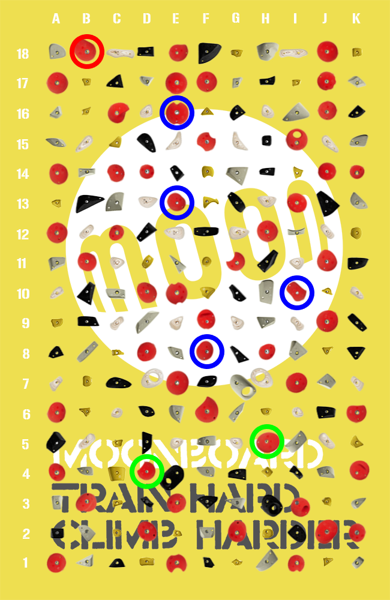

# MoonboardML
The MoonBoard is a standardised interactive rock climbing training wall that connects a global community of climbers through shared problems and competitive performance rankings. climbing problems can be set on the MoonBoard as shown in Figure 2 and added to an online database. In this way, climbers from around the world can participate in an online community where problems are created, shared, and rated. Problems are also given a difficult rating (grade) by given by the route setter and a crowd sourced grade given by the community, who have also climbed the route.

Throughout this project we build a classifier to predict the grade of a MoonBoard problem given only the specific holds used. We compare the performance of a Convolutional Neural Network against a Long Short-Term Memory Network which is able to capture additional information from the order in which the holds are used when climbing the problem. 

We also experiement with a Variational Auto-Encoder to autonomously generate new moonboard problems
